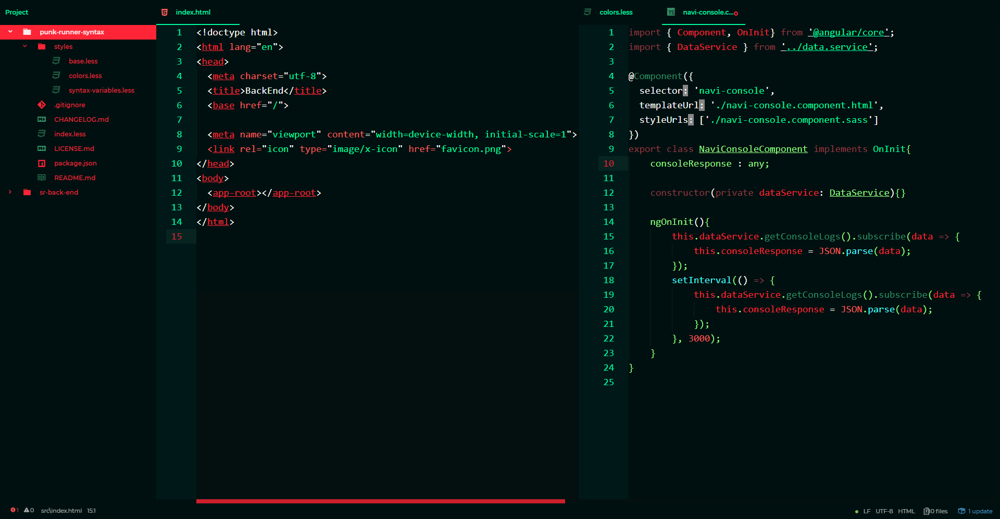
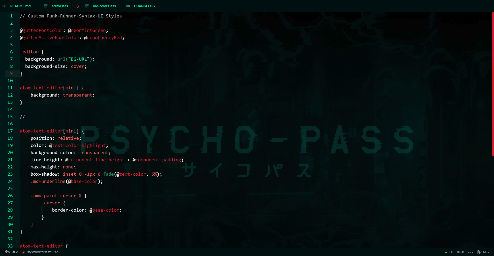
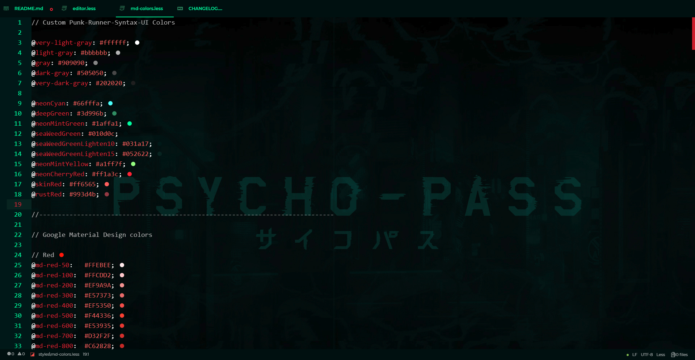
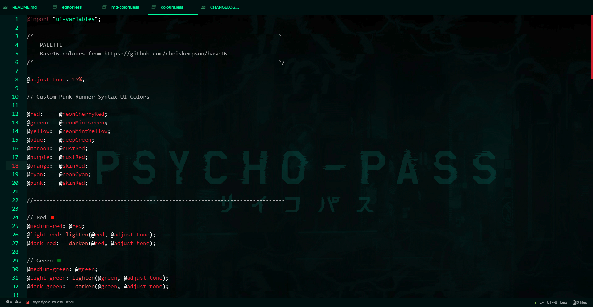

# punk-runner-syntax theme

the punk-runner-syntax theme combines green and red colors to a cyberpunk-like style.

HTML and Ts file in the punk-runner-syntax theme compined with edited versions of the atom-material-ui and file-icons.

## Installation

From the command line: `apm install punk-runner-syntax`

Or directly in Atom:

1. Open __Settings__ > __Install__
2. Set the filter to __Themes__
3. Search for `punk-runner-syntax` and click __Install__

Once installed, open __Settings__ > __Themes__ and select __punk-runner-syntax__.

## Nice to know

Colors:

    very-light-gray: #ffffff;
    light-gray: #bbbbbb;
    gray: #909090;
    dark-gray: #505050;
    very-dark-gray: #202020;

    neonCyan: #66fffa;
    deepGreen: #3d996b;
    neonMintGreen: #1affa1;
    seaWeedGreen: #010d0c;
    seaWeedGreenLighten10: #031a17;
    seaWeedGreenLighten15: #052622;
    neonMintYellow: #a1ff7f;
    neonCherryRed: #ff1a3c;
    skinRed: #ff6565;
    rustRed: #993d4b;

atom-material-ui settings:

    Primary Color: neonCherryRed
    Secondary Color: seaWeedGreen

atom-material-ui edits:

    Added a background to the editor.

    Added punk-runner-syntax colors to md_colors.less.

file-icons package edits:

    
    Added punk-runner-syntax colors to colours.less.
